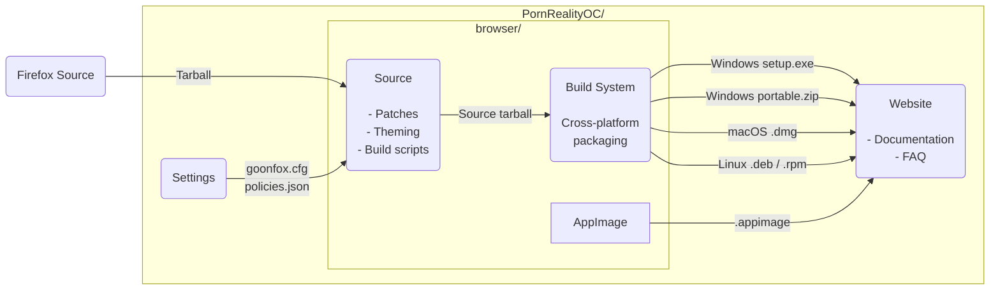

# Goonfox Source Repository

Goonfox is a privacy-first, Firefox-based browser built for adult content consumers. It ships with aggressive ad and tracker blocking, hardened privacy defaults, and a clean experience optimized for the way gooners actually browse.

This repository contains all the patches, theming, and build scripts that make up Goonfox. There is also a [Settings repository](https://github.com/PornRealityOC/goonfox-settings), which contains the Goonfox preferences.

## Overview



## Features

- **Privacy first** — zero telemetry, fingerprint resistance, cookie isolation
- **uBlock Origin** — pre-installed with extended filter lists tuned for adult sites
- **Tracker blocking** — Brave-level protection baked into defaults
- **Hardened defaults** — based on arkenfox `user.js`, tuned for real-world usability
- **Cross-platform** — macOS, Windows, Linux

## Build Instructions

There are two ways to build Goonfox: from the source tarball, or directly from this repository.

### Building from the Tarball

Download the latest tarball from [Releases](https://github.com/PornRealityOC/goonfox/releases).

```bash
tar xf <tarball>
cd <folder>
```

Bootstrap your system (one time only):

```bash
./mach --no-interactive bootstrap --application-choice=browser
```

Build and run:

```bash
./mach build
./mach package
# OR
./mach run
```

### Building from this Repository

Clone the repository:

```bash
git clone --recursive https://github.com/PornRealityOC/goonfox.git
cd goonfox
```

Build the source:

```bash
make dir
```

Bootstrap your system (one time only):

```bash
make bootstrap
```

Build and run:

```bash
make build
make package
# OR
make run
```

## Development Notes

### How to make a patch

```bash
cd goonfox-$(cat version)
git init
git add <path_to_file_you_changed>
git commit -am initial-commit
git diff > ../mypatch.patch
```

### How to work on an existing patch

```bash
make fetch
./scripts/git-patchtree.sh patches/sed-patches/some-patch.patch
```

Make your changes, then export the updated patch:

```bash
cd firefox-<version>
git diff 4b825dc642cb6eb9a060e54bf8d69288fbee4904 HEAD > ../my-patch-name.patch
```

### Contributing a patch upstream to Mozilla

Mozilla only accepts patches against Nightly. Setup:

```bash
hg clone https://hg.mozilla.org/mozilla-unified
cd mozilla-unified
hg update
MOZBUILD_STATE_PATH=$HOME/.mozbuild ./mach --no-interactive bootstrap --application-choice=browser
./mach build
```

Apply your patch and create the Nightly diff:

```bash
patch -p1 -i ../mypatch.patch
hg diff > ../my-nightly-patch.patch
```

## Platform Notes

- **macOS**: Cross-compiled `.dmg` builds are supported.
- **Windows**: Building on Windows is functional but less tested. Contributions welcome.
- **Linux**: `.deb`, `.rpm`, AppImage, and Flatpak targets supported.

## License

[MPL-2.0](LICENSE)
